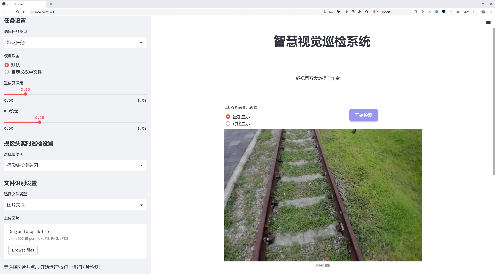
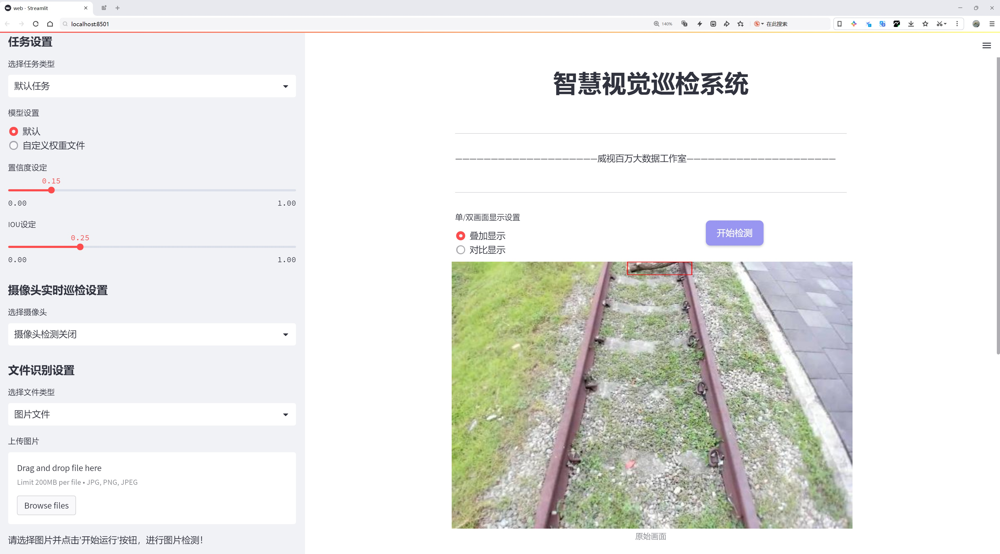
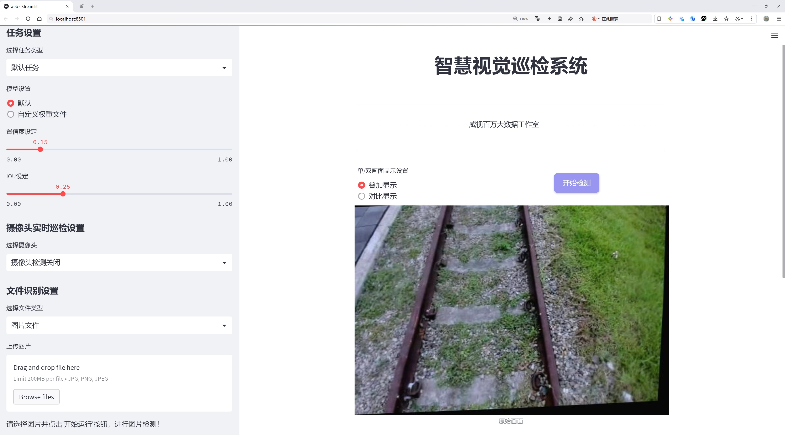
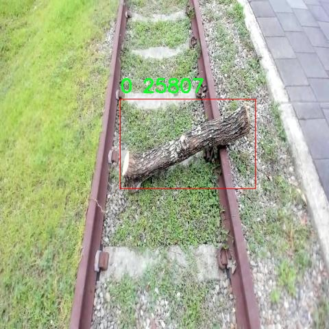
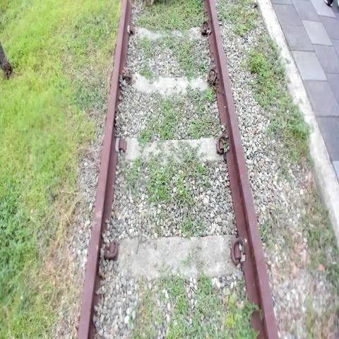
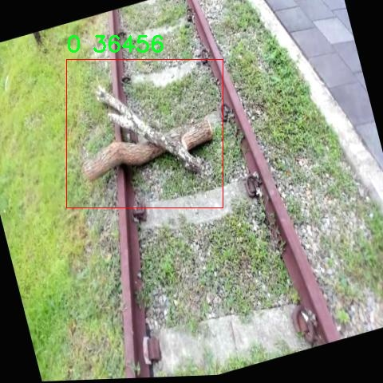
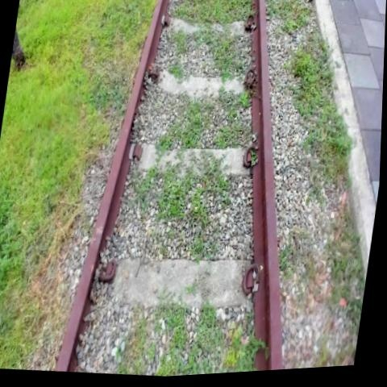
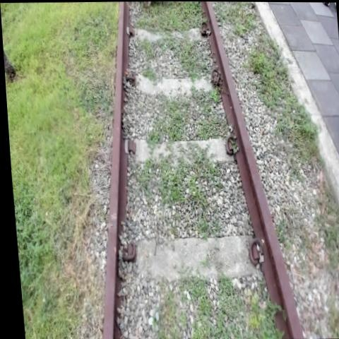

# 铁路断木侵限检测检测系统源码分享
 # [一条龙教学YOLOV8标注好的数据集一键训练_70+全套改进创新点发刊_Web前端展示]

### 1.研究背景与意义

项目参考[AAAI Association for the Advancement of Artificial Intelligence](https://gitee.com/qunmasj/projects)

研究背景与意义

随着城市化进程的加快，铁路运输在现代社会中扮演着越来越重要的角色。然而，铁路沿线的安全隐患，尤其是自然因素造成的障碍物，如断木、树枝等，严重威胁着列车的安全运行。根据相关统计数据，因铁路沿线的障碍物导致的事故频繁发生，给社会带来了巨大的经济损失和人员伤亡。因此，开发一种高效、准确的铁路断木侵限检测系统显得尤为重要。传统的人工巡检方式不仅效率低下，而且容易受到天气、光照等因素的影响，难以保证检测的全面性和及时性。基于此，利用计算机视觉和深度学习技术，构建一个智能化的铁路断木侵限检测系统，成为了研究的重点。

YOLO（You Only Look Once）系列算法因其高效的实时目标检测能力而广泛应用于各类视觉识别任务。YOLOv8作为该系列的最新版本，进一步提升了检测精度和速度，适应了复杂环境下的目标检测需求。然而，铁路沿线的环境通常光照不足，且障碍物的形态多样，给目标检测带来了挑战。因此，针对YOLOv8进行改进，以适应低光照环境下的铁路断木检测，具有重要的理论和实践意义。

本研究将基于“railway_lowlight_tree”数据集，该数据集包含2432张图像，专注于低光照条件下的铁路断木检测。该数据集的单一类别设计，使得模型在训练过程中能够专注于特定目标，减少了背景干扰，提高了检测的准确性。这一数据集的构建，不仅为本研究提供了丰富的训练样本，也为后续的相关研究提供了宝贵的参考资料。

通过改进YOLOv8模型，结合该数据集的特性，研究将探索如何提高模型在低光照条件下的鲁棒性和检测精度。具体而言，将重点关注模型的特征提取能力、数据增强技术以及后处理算法的优化，以实现对铁路断木的快速、准确检测。此外，研究还将探讨模型在实际应用中的可行性，包括其在不同光照和天气条件下的表现，进而为铁路安全管理提供科学依据。

综上所述，基于改进YOLOv8的铁路断木侵限检测系统的研究，不仅具有重要的学术价值，也对铁路安全运营具有深远的现实意义。通过实现智能化的障碍物检测，能够有效降低铁路事故发生的风险，提高铁路运输的安全性和效率，为保障人民生命财产安全贡献力量。

### 2.图片演示







##### 注意：由于此博客编辑较早，上面“2.图片演示”和“3.视频演示”展示的系统图片或者视频可能为老版本，新版本在老版本的基础上升级如下：（实际效果以升级的新版本为准）

  （1）适配了YOLOV8的“目标检测”模型和“实例分割”模型，通过加载相应的权重（.pt）文件即可自适应加载模型。

  （2）支持“图片识别”、“视频识别”、“摄像头实时识别”三种识别模式。

  （3）支持“图片识别”、“视频识别”、“摄像头实时识别”三种识别结果保存导出，解决手动导出（容易卡顿出现爆内存）存在的问题，识别完自动保存结果并导出到。

  （4）支持Web前端系统中的标题、背景图等自定义修改，后面提供修改教程。

  另外本项目提供训练的数据集和训练教程,暂不提供权重文件（best.pt）,需要您按照教程进行训练后实现图片演示和Web前端界面演示的效果。

### 3.视频演示

[3.1 视频演示](https://www.bilibili.com/video/BV1VRW1eTEHU/?vd_source=ff015de2d29cbe2a9cdbfa7064407a08)

### 4.数据集信息展示

数据集信息展示

本数据集名为“railway_lowlight_tree”，专为改进YOLOv8的铁路断木侵限检测系统而设计。该数据集包含2432幅图像，旨在为研究人员和开发者提供丰富的视觉数据，以提升铁路安全监测的效率和准确性。数据集的主要特征在于其专注于低光照环境下的树木检测，这对于铁路沿线的安全管理至关重要，尤其是在夜间或能见度较低的情况下。

在这个数据集中，所有图像均属于同一类别，专注于铁路附近可能影响行车安全的树木和断木。这一单一类别的设计使得模型在训练过程中能够更加专注于特定的目标，从而提高检测的精度和可靠性。虽然类别数量有限，但通过多样化的图像样本，数据集依然能够提供丰富的特征信息，帮助模型学习在不同环境和条件下的树木特征。

该数据集的图像涵盖了多种场景，包括不同时间段的低光照条件，这为模型的训练提供了良好的基础。通过对这些图像的分析，YOLOv8模型能够学习到在光线不足的情况下，如何有效识别和定位铁路周边的潜在障碍物。这一特性对于铁路运输的安全性至关重要，因为断木或其他障碍物的及时检测可以显著降低事故发生的风险。

此外，数据集的使用遵循CC BY 4.0许可证，这意味着用户可以自由地使用、修改和分发数据集，只需适当引用原作者。这种开放的许可政策鼓励了学术界和工业界的广泛合作，使得更多的研究人员能够利用这一数据集进行相关的研究和开发，推动铁路安全技术的进步。

数据集的获取和使用也非常便捷，用户只需访问指定链接即可下载所需的图像。这种易于访问的特性使得研究人员能够快速开始他们的项目，而无需耗费大量时间在数据收集和整理上。这一数据集的设计初衷不仅是为了提供高质量的训练数据，更是为了促进铁路安全监测技术的快速发展。

总之，“railway_lowlight_tree”数据集以其丰富的图像样本和专注于特定类别的设计，为改进YOLOv8模型在铁路断木侵限检测中的应用提供了坚实的基础。通过利用这一数据集，研究人员能够更好地理解和应对铁路安全面临的挑战，推动智能监测系统的不断进步。











### 5.全套项目环境部署视频教程（零基础手把手教学）

[5.1 环境部署教程链接（零基础手把手教学）](https://www.ixigua.com/7404473917358506534?logTag=c807d0cbc21c0ef59de5)


[5.2 安装Python虚拟环境创建和依赖库安装视频教程链接（零基础手把手教学）](https://www.ixigua.com/7404474678003106304?logTag=1f1041108cd1f708b01a)

### 6.手把手YOLOV8训练视频教程（零基础小白有手就能学会）

[6.1 环境部署教程链接（零基础手把手教学）](https://www.ixigua.com/7404477157818401292?logTag=d31a2dfd1983c9668658)

### 7.70+种全套YOLOV8创新点代码加载调参视频教程（一键加载写好的改进模型的配置文件）

[7.1 环境部署教程链接（零基础手把手教学）](https://www.ixigua.com/7404478314661806627?logTag=29066f8288e3f4eea3a4)

### 8.70+种全套YOLOV8创新点原理讲解（非科班也可以轻松写刊发刊，V10版本正在科研待更新）

由于篇幅限制，每个创新点的具体原理讲解就不一一展开，具体见下列网址中的创新点对应子项目的技术原理博客网址【Blog】：


[8.1 70+种全套YOLOV8创新点原理讲解链接](https://gitee.com/qunmasj/good)

### 9.系统功能展示（检测对象为举例，实际内容以本项目数据集为准）

图1.系统支持检测结果表格显示

  图2.系统支持置信度和IOU阈值手动调节

  图3.系统支持自定义加载权重文件best.pt(需要你通过步骤5中训练获得)

  图4.系统支持摄像头实时识别

  图5.系统支持图片识别

  图6.系统支持视频识别

  图7.系统支持识别结果文件自动保存

  图8.系统支持Excel导出检测结果数据


### 10.原始YOLOV8算法原理

原始YOLOv8算法原理

YOLOv8算法是目标检测领域的一项重要进展，由Glenn-Jocher于2023年提出。作为YOLO系列的最新版本，YOLOv8在YOLOv3和YOLOv5的基础上进行了多项关键改进，旨在提高目标检测的精度和速度。该算法不仅继承了前几代YOLO算法的优点，还在多个方面进行了创新，使其在实际应用中展现出更强的性能。

首先，YOLOv8在数据预处理方面延续了YOLOv5的策略，采用了多种数据增强技术以提升模型的鲁棒性和泛化能力。具体而言，YOLOv8使用了马赛克增强、混合增强、空间扰动和颜色扰动等四种增强手段。这些技术的结合不仅丰富了训练数据的多样性，还有效地提高了模型对不同场景和物体的适应能力。马赛克增强通过将多张图像拼接在一起，生成新的训练样本，增强了模型对小物体的检测能力；而混合增强则通过将不同图像进行混合，进一步提升了模型的学习效果。

在骨干网络结构方面，YOLOv8的设计延续了YOLOv5的清晰架构，采用了新的C2f模块来替代原有的C3模块。C2f模块通过引入更多的分支，增强了梯度回传时的特征流动，进而提高了特征表示能力。这种结构的设计不仅提升了模型的学习效率，还增强了对复杂特征的捕捉能力，使得YOLOv8在处理高分辨率图像时表现更加出色。

YOLOv8继续采用特征金字塔网络（FPN）和路径聚合网络（PAN）的结合结构，以实现多尺度信息的充分融合。FPN通过构建特征金字塔，能够有效地处理不同尺度的目标，而PAN则通过加强不同层次特征的融合，进一步提升了模型对小物体的检测能力。尽管YOLOv8在这一结构上与YOLOv5保持一致，但通过引入C2f模块，YOLOv8在特征融合的深度和广度上都得到了显著提升。

在检测头的设计上，YOLOv8采用了解耦头结构，这一结构的引入使得分类和定位任务可以独立进行，从而提高了检测的精度。与YOLOv3和YOLOv5的耦合头不同，YOLOv8的解耦头通过两条并行分支分别提取类别特征和位置特征，最终通过1×1卷积完成分类和定位任务。这种设计使得模型在处理复杂场景时，能够更好地分离不同任务的特征，进而提升整体的检测性能。

在标签分配策略方面，YOLOv8引入了动态标签分配策略，解决了正负样本匹配的问题。与YOLOX使用的SimOTA策略不同，YOLOv8采用了与YOLOv6相同的TOOD策略。这一策略通过动态调整正负样本的分配，使得模型在训练过程中能够更好地适应数据集的特征。YOLOv8的损失函数主要包括类别损失和位置损失，其中类别损失采用了变焦损失（VFL Loss），而回归损失则结合了CIoULoss和DFLLoss。这种损失函数的设计，使得模型在训练时能够更加关注高质量的正样本，同时降低负样本对损失的影响，从而提升模型的整体性能。

YOLOv8的网络结构分为输入端、骨干网络、颈部网络和头部网络四个部分。输入端主要负责数据的预处理，包括马赛克数据增强、自适应锚框计算和自适应灰度填充等；骨干网络则通过C2f和SPPF结构提取特征；颈部网络采用PAN结构以增强不同尺度特征的融合能力；头部网络则通过解耦结构进行分类和检测，确保了模型在复杂场景下的高效性和准确性。

相较于YOLOv5，YOLOv8在模型深度和参数量上进行了优化，推出了多种不同规模的模型，以适应不同的应用场景。YOLOv8n作为参数量最小且检测速度最快的版本，能够在保证实时性的同时，提供较高的检测精度。这种灵活的模型设计，使得YOLOv8能够广泛应用于智能监控、自动驾驶、人脸识别等多个领域，展现出极大的应用潜力。

总的来说，YOLOv8算法通过对数据预处理、骨干网络、特征融合、检测头和标签分配策略等多个方面的改进，显著提升了目标检测的精度和速度。作为YOLO系列的最新作品，YOLOv8不仅在理论上进行了创新，更在实际应用中展现出强大的性能，为目标检测领域的发展提供了新的动力。


### 11.项目核心源码讲解（再也不用担心看不懂代码逻辑）

#### 11.1 ui.py

以下是经过简化和注释的核心代码部分：

```python
import sys
import subprocess

def run_script(script_path):
    """
    使用当前 Python 环境运行指定的脚本。

    Args:
        script_path (str): 要运行的脚本路径
    """
    # 获取当前 Python 解释器的路径
    python_path = sys.executable

    # 构建运行命令，使用 streamlit 运行指定的脚本
    command = f'"{python_path}" -m streamlit run "{script_path}"'

    # 执行命令，并等待其完成
    result = subprocess.run(command, shell=True)
    
    # 检查命令执行结果，如果返回码不为0，则表示出错
    if result.returncode != 0:
        print("脚本运行出错。")

# 主程序入口
if __name__ == "__main__":
    # 指定要运行的脚本路径
    script_path = "web.py"  # 这里可以直接指定脚本名

    # 调用函数运行脚本
    run_script(script_path)
```

### 代码注释说明：
1. **导入模块**：
   - `sys`：用于获取当前 Python 解释器的路径。
   - `subprocess`：用于执行外部命令。

2. **`run_script` 函数**：
   - 该函数接收一个脚本路径作为参数，并使用当前 Python 环境运行该脚本。
   - 使用 `sys.executable` 获取当前 Python 解释器的路径，以确保使用正确的 Python 版本。
   - 构建命令字符串，使用 `streamlit` 运行指定的脚本。
   - 使用 `subprocess.run` 执行命令，并等待其完成。`shell=True` 允许在 shell 中执行命令。
   - 检查命令的返回码，如果不为0，表示脚本运行出错，打印错误信息。

3. **主程序入口**：
   - 使用 `if __name__ == "__main__":` 确保该代码块仅在直接运行该脚本时执行。
   - 指定要运行的脚本路径（这里直接使用了 `"web.py"`）。
   - 调用 `run_script` 函数来执行指定的脚本。

这个程序文件 `ui.py` 的主要功能是运行一个指定的 Python 脚本，具体来说是使用 Streamlit 框架来启动一个 Web 应用。代码中首先导入了必要的模块，包括 `sys`、`os` 和 `subprocess`，这些模块分别用于获取系统信息、处理文件路径和执行外部命令。

在文件的开头，定义了一个名为 `run_script` 的函数，该函数接受一个参数 `script_path`，表示要运行的脚本的路径。函数内部首先获取当前 Python 解释器的路径，使用 `sys.executable` 可以得到当前环境下 Python 的完整路径。接着，构建一个命令字符串，该命令使用 Streamlit 来运行指定的脚本，格式为 `"{python_path}" -m streamlit run "{script_path}"`。这里的 `-m` 参数表示以模块的方式运行 Streamlit。

然后，使用 `subprocess.run` 方法来执行构建好的命令。该方法会在一个新的 shell 中运行命令，并返回一个结果对象。通过检查 `result.returncode`，可以判断脚本是否成功运行。如果返回码不为 0，表示运行过程中出现了错误，此时会打印出“脚本运行出错”的提示信息。

在文件的最后部分，使用 `if __name__ == "__main__":` 来确保当该文件作为主程序运行时，才会执行以下代码。这里指定了要运行的脚本路径，调用了 `abs_path` 函数来获取 `web.py` 的绝对路径。最后，调用 `run_script` 函数来启动这个脚本。

总体来看，这个文件的功能是将指定的 Streamlit 脚本作为一个 Web 应用启动，并提供了基本的错误处理机制。

#### 11.2 ultralytics\utils\callbacks\dvc.py

以下是代码中最核心的部分，并附上详细的中文注释：

```python
# 导入必要的库
from ultralytics.utils import LOGGER, SETTINGS, TESTS_RUNNING, checks

try:
    # 确保没有在运行测试
    assert not TESTS_RUNNING  
    # 确保DVC集成已启用
    assert SETTINGS["dvc"] is True  
    import dvclive  # 导入DVC Live库

    # 检查DVC Live的版本
    assert checks.check_version("dvclive", "2.11.0", verbose=True)

    import os
    import re
    from pathlib import Path

    # 创建DVC Live日志实例
    live = None
    _processed_plots = {}  # 存储已处理的图表

    # 训练周期标志
    _training_epoch = False

except (ImportError, AssertionError, TypeError):
    dvclive = None  # 如果导入失败，则将dvclive设置为None


def _log_images(path, prefix=""):
    """使用DVCLive记录指定路径的图像，带有可选前缀。"""
    if live:  # 如果DVC Live实例存在
        name = path.name

        # 按批次分组图像，以便在UI中启用滑块
        m = re.search(r"_batch(\d+)", name)
        if m:
            ni = m[1]
            new_stem = re.sub(r"_batch(\d+)", "_batch", path.stem)
            name = (Path(new_stem) / ni).with_suffix(path.suffix)

        # 记录图像
        live.log_image(os.path.join(prefix, name), path)


def on_train_start(trainer):
    """如果DVC Live日志记录处于活动状态，则记录训练参数。"""
    if live:
        live.log_params(trainer.args)  # 记录训练参数


def on_fit_epoch_end(trainer):
    """在每个训练周期结束时记录训练指标和模型信息。"""
    global _training_epoch
    if live and _training_epoch:  # 如果DVC Live存在且当前为训练周期
        all_metrics = {**trainer.label_loss_items(trainer.tloss, prefix="train"), **trainer.metrics, **trainer.lr}
        for metric, value in all_metrics.items():
            live.log_metric(metric, value)  # 记录每个指标

        # 在第一个周期记录模型信息
        if trainer.epoch == 0:
            from ultralytics.utils.torch_utils import model_info_for_loggers
            for metric, value in model_info_for_loggers(trainer).items():
                live.log_metric(metric, value, plot=False)

        live.next_step()  # 进入下一个步骤
        _training_epoch = False  # 重置训练周期标志


def on_train_end(trainer):
    """在训练结束时记录最佳指标、图表和混淆矩阵。"""
    if live:
        # 记录最佳指标
        all_metrics = {**trainer.label_loss_items(trainer.tloss, prefix="train"), **trainer.metrics, **trainer.lr}
        for metric, value in all_metrics.items():
            live.log_metric(metric, value, plot=False)

        # 记录验证集的图表和混淆矩阵
        _log_confusion_matrix(trainer.validator)
        live.end()  # 结束DVC Live日志记录


# 定义回调函数
callbacks = (
    {
        "on_train_start": on_train_start,
        "on_fit_epoch_end": on_fit_epoch_end,
        "on_train_end": on_train_end,
    }
    if dvclive
    else {}
)
```

### 代码说明：
1. **导入模块**：导入必要的库和模块，包括Ultralytics的工具和DVC Live。
2. **初始化**：在尝试块中，检查DVC集成是否启用，并导入DVC Live。如果出现错误，则将`dvclive`设置为`None`。
3. **日志记录函数**：
   - `_log_images`：记录图像到DVC Live。
   - `on_train_start`：在训练开始时记录参数。
   - `on_fit_epoch_end`：在每个训练周期结束时记录指标和模型信息。
   - `on_train_end`：在训练结束时记录最佳指标和混淆矩阵。
4. **回调函数**：根据DVC Live的状态定义相应的回调函数。

这个程序文件是Ultralytics YOLO项目中的一个回调模块，主要用于集成DVCLive库，以便在训练过程中记录和可视化模型的训练进度和性能。文件首先导入了一些必要的模块和库，包括日志记录器、设置和检查工具。接着，它尝试验证DVCLive的集成是否启用，并检查其版本是否符合要求。

在程序中，定义了一些全局变量，例如`live`用于存储DVCLive的实例，`_processed_plots`用于跟踪已经处理的图像。`_training_epoch`是一个布尔值，用于指示当前是否处于训练周期。

接下来的几个函数负责记录不同类型的数据。`_log_images`函数用于记录指定路径下的图像，并根据需要添加前缀。`_log_plots`函数用于记录训练过程中的图像，如果这些图像尚未被处理。`_log_confusion_matrix`函数则用于记录混淆矩阵，提供模型在分类任务中的性能评估。

在训练的不同阶段，程序会调用特定的回调函数。例如，`on_pretrain_routine_start`在预训练开始时初始化DVCLive记录器，并记录相关信息；`on_train_start`在训练开始时记录训练参数；`on_fit_epoch_end`在每个训练周期结束时记录训练指标和模型信息，并准备进入下一个步骤；`on_train_end`在训练结束时记录最佳指标、图像和混淆矩阵。

最后，程序定义了一个`callbacks`字典，其中包含了各个回调函数的映射关系，如果DVCLive未激活，则该字典为空。这个设计使得在训练过程中能够灵活地记录和可视化模型的训练进度和性能，从而帮助开发者更好地理解和优化模型。

#### 11.3 ultralytics\trackers\utils\gmc.py

以下是代码中最核心的部分，并附上详细的中文注释：

```python
import cv2
import numpy as np

class GMC:
    """
    一般化运动补偿（GMC）类，用于视频帧中的跟踪和物体检测。
    """

    def __init__(self, method: str = "sparseOptFlow", downscale: int = 2) -> None:
        """
        初始化视频跟踪器，设置跟踪方法和缩放因子。

        参数:
            method (str): 用于跟踪的方法，包括 'orb', 'sift', 'ecc', 'sparseOptFlow', 'none'。
            downscale (int): 处理帧的缩放因子。
        """
        self.method = method  # 设置跟踪方法
        self.downscale = max(1, int(downscale))  # 确保缩放因子至少为1

        # 根据选择的方法初始化检测器、提取器和匹配器
        if self.method == "orb":
            self.detector = cv2.FastFeatureDetector_create(20)
            self.extractor = cv2.ORB_create()
            self.matcher = cv2.BFMatcher(cv2.NORM_HAMMING)
        elif self.method == "sift":
            self.detector = cv2.SIFT_create(nOctaveLayers=3, contrastThreshold=0.02, edgeThreshold=20)
            self.extractor = cv2.SIFT_create(nOctaveLayers=3, contrastThreshold=0.02, edgeThreshold=20)
            self.matcher = cv2.BFMatcher(cv2.NORM_L2)
        elif self.method == "ecc":
            self.warp_mode = cv2.MOTION_EUCLIDEAN
            self.criteria = (cv2.TERM_CRITERIA_EPS | cv2.TERM_CRITERIA_COUNT, 5000, 1e-6)
        elif self.method == "sparseOptFlow":
            self.feature_params = dict(maxCorners=1000, qualityLevel=0.01, minDistance=1, blockSize=3)
        elif self.method in {"none", "None", None}:
            self.method = None
        else:
            raise ValueError(f"错误: 未知的GMC方法: {method}")

        # 初始化状态变量
        self.prevFrame = None  # 前一帧
        self.prevKeyPoints = None  # 前一帧的关键点
        self.prevDescriptors = None  # 前一帧的描述符
        self.initializedFirstFrame = False  # 标志位，指示是否已处理第一帧

    def apply(self, raw_frame: np.array) -> np.array:
        """
        使用指定的方法对原始帧进行物体检测。

        参数:
            raw_frame (np.array): 要处理的原始帧。

        返回:
            (np.array): 处理后的帧。
        """
        if self.method in ["orb", "sift"]:
            return self.applyFeatures(raw_frame)  # 应用特征检测方法
        elif self.method == "ecc":
            return self.applyEcc(raw_frame)  # 应用ECC算法
        elif self.method == "sparseOptFlow":
            return self.applySparseOptFlow(raw_frame)  # 应用稀疏光流法
        else:
            return np.eye(2, 3)  # 返回单位矩阵

    def applyEcc(self, raw_frame: np.array) -> np.array:
        """
        对原始帧应用ECC算法。

        参数:
            raw_frame (np.array): 要处理的原始帧。

        返回:
            (np.array): 处理后的帧。
        """
        height, width, _ = raw_frame.shape  # 获取帧的高度和宽度
        frame = cv2.cvtColor(raw_frame, cv2.COLOR_BGR2GRAY)  # 转换为灰度图
        H = np.eye(2, 3, dtype=np.float32)  # 初始化变换矩阵为单位矩阵

        # 处理第一帧
        if not self.initializedFirstFrame:
            self.prevFrame = frame.copy()  # 保存当前帧为前一帧
            self.initializedFirstFrame = True  # 设置标志位为True
            return H  # 返回单位矩阵

        # 运行ECC算法，获取变换矩阵H
        try:
            (cc, H) = cv2.findTransformECC(self.prevFrame, frame, H, self.warp_mode, self.criteria, None, 1)
        except Exception as e:
            print(f"警告: 变换失败，设置为单位矩阵 {e}")

        return H  # 返回变换矩阵

    def applyFeatures(self, raw_frame: np.array) -> np.array:
        """
        对原始帧应用特征检测方法（如ORB或SIFT）。

        参数:
            raw_frame (np.array): 要处理的原始帧。

        返回:
            (np.array): 处理后的帧。
        """
        height, width, _ = raw_frame.shape  # 获取帧的高度和宽度
        frame = cv2.cvtColor(raw_frame, cv2.COLOR_BGR2GRAY)  # 转换为灰度图
        H = np.eye(2, 3)  # 初始化变换矩阵为单位矩阵

        # 处理第一帧
        if not self.initializedFirstFrame:
            self.prevFrame = frame.copy()  # 保存当前帧为前一帧
            self.initializedFirstFrame = True  # 设置标志位为True
            return H  # 返回单位矩阵

        # 检测关键点并计算描述符
        keypoints = self.detector.detect(frame, None)  # 检测关键点
        keypoints, descriptors = self.extractor.compute(frame, keypoints)  # 计算描述符

        # 匹配描述符
        knnMatches = self.matcher.knnMatch(self.prevDescriptors, descriptors, 2)  # KNN匹配

        # 过滤匹配
        goodMatches = []
        for m, n in knnMatches:
            if m.distance < 0.9 * n.distance:  # 过滤条件
                goodMatches.append(m)

        # 计算变换矩阵
        if len(goodMatches) > 4:  # 至少需要5个匹配点
            prevPoints = np.array([self.prevKeyPoints[m.queryIdx].pt for m in goodMatches])
            currPoints = np.array([keypoints[m.trainIdx].pt for m in goodMatches])
            H, _ = cv2.estimateAffinePartial2D(prevPoints, currPoints, cv2.RANSAC)  # 估计变换矩阵

        self.prevFrame = frame.copy()  # 更新前一帧
        self.prevKeyPoints = keypoints  # 更新前一帧的关键点
        self.prevDescriptors = descriptors  # 更新前一帧的描述符

        return H  # 返回变换矩阵

    def applySparseOptFlow(self, raw_frame: np.array) -> np.array:
        """
        对原始帧应用稀疏光流法。

        参数:
            raw_frame (np.array): 要处理的原始帧。

        返回:
            (np.array): 处理后的帧。
        """
        height, width, _ = raw_frame.shape  # 获取帧的高度和宽度
        frame = cv2.cvtColor(raw_frame, cv2.COLOR_BGR2GRAY)  # 转换为灰度图
        H = np.eye(2, 3)  # 初始化变换矩阵为单位矩阵

        # 处理第一帧
        if not self.initializedFirstFrame:
            self.prevFrame = frame.copy()  # 保存当前帧为前一帧
            self.initializedFirstFrame = True  # 设置标志位为True
            return H  # 返回单位矩阵

        # 计算光流
        matchedKeypoints, status, _ = cv2.calcOpticalFlowPyrLK(self.prevFrame, frame, self.prevKeyPoints, None)

        # 过滤有效的匹配点
        prevPoints = []
        currPoints = []
        for i in range(len(status)):
            if status[i]:
                prevPoints.append(self.prevKeyPoints[i])
                currPoints.append(matchedKeypoints[i])

        prevPoints = np.array(prevPoints)
        currPoints = np.array(currPoints)

        # 计算变换矩阵
        if len(prevPoints) > 4:  # 至少需要5个匹配点
            H, _ = cv2.estimateAffinePartial2D(prevPoints, currPoints, cv2.RANSAC)

        self.prevFrame = frame.copy()  # 更新前一帧
        self.prevKeyPoints = prevPoints  # 更新前一帧的关键点

        return H  # 返回变换矩阵
```

### 代码说明：
1. **类的定义**：`GMC`类用于实现一般化运动补偿，支持多种跟踪方法。
2. **初始化方法**：`__init__`方法用于设置跟踪方法和缩放因子，并初始化相关参数。
3. **应用方法**：`apply`方法根据选择的跟踪方法处理输入帧。
4. **ECC算法**：`applyEcc`方法实现了基于增强相关性的方法来估计帧间的变换。
5. **特征检测**：`applyFeatures`方法使用ORB或SIFT算法检测特征并进行匹配。
6. **稀疏光流法**：`applySparseOptFlow`方法使用稀疏光流法计算帧间的运动。

以上是代码的核心部分及其详细注释，涵盖了类的功能和主要方法的实现逻辑。

这个程序文件定义了一个名为 `GMC` 的类，主要用于视频帧中的跟踪和物体检测。该类实现了多种跟踪算法，包括 ORB、SIFT、ECC 和稀疏光流，能够根据需要对帧进行下采样以提高计算效率。

在 `GMC` 类的构造函数中，用户可以指定跟踪方法和下采样因子。支持的跟踪方法包括 'orb'、'sift'、'ecc'、'sparseOptFlow' 和 'none'。根据选择的跟踪方法，类会初始化相应的特征检测器、描述符提取器和匹配器。类中还定义了一些属性，用于存储前一帧的图像、关键点和描述符，以及一个标志位以指示是否已处理第一帧。

`apply` 方法是该类的主要接口，接受原始帧和可选的检测结果作为输入，并根据所选的方法调用相应的处理函数。具体的处理方法包括 `applyEcc`、`applyFeatures` 和 `applySparseOptFlow`，分别实现了 ECC 算法、特征点方法（如 ORB 或 SIFT）和稀疏光流法。

在 `applyEcc` 方法中，首先将输入帧转换为灰度图像，并根据下采样因子对其进行处理。该方法使用 ECC 算法进行图像配准，并返回变换矩阵。若是处理第一帧，则会初始化前一帧数据。

`applyFeatures` 方法同样处理输入帧，将其转换为灰度图像并进行下采样。然后，它会检测关键点并计算描述符。接着，使用 KNN 匹配器匹配前一帧和当前帧的描述符，并根据空间距离过滤匹配结果。最后，使用 RANSAC 方法估计刚性变换矩阵。

`applySparseOptFlow` 方法实现了稀疏光流法。它同样将输入帧转换为灰度图像，并检测关键点。通过光流法计算前一帧和当前帧之间的对应关系，并估计变换矩阵。

此外，类中还提供了 `reset_params` 方法，用于重置所有参数，方便在不同的跟踪任务中重新初始化。

整体而言，这个 `GMC` 类为视频处理提供了一种灵活的框架，允许用户根据不同的需求选择合适的跟踪算法，并对视频帧进行高效的处理。

#### 11.4 train.py

以下是代码中最核心的部分，并附上详细的中文注释：

```python
import os
import torch
import yaml
from ultralytics import YOLO  # 导入YOLO模型库
from QtFusion.path import abs_path  # 导入路径处理工具

# 设置设备为GPU（如果可用），否则使用CPU
device = "0" if torch.cuda.is_available() else "cpu"

if __name__ == '__main__':  # 确保该模块被直接运行时才执行以下代码
    workers = 1  # 设置数据加载的工作进程数
    batch = 2    # 设置每个批次的样本数量

    data_name = "data"  # 数据集名称
    # 获取数据集配置文件的绝对路径
    data_path = abs_path(f'datasets/{data_name}/{data_name}.yaml', path_type='current')  
    unix_style_path = data_path.replace(os.sep, '/')  # 将路径转换为Unix风格

    # 获取数据集所在目录的路径
    directory_path = os.path.dirname(unix_style_path)
    
    # 读取YAML格式的数据集配置文件
    with open(data_path, 'r') as file:
        data = yaml.load(file, Loader=yaml.FullLoader)
    
    # 如果配置文件中包含'path'项，则修改为数据集目录路径
    if 'path' in data:
        data['path'] = directory_path
        # 将修改后的数据写回YAML文件
        with open(data_path, 'w') as file:
            yaml.safe_dump(data, file, sort_keys=False)

    # 加载YOLOv8模型的配置文件
    model = YOLO(model='./ultralytics/cfg/models/v8/yolov8s.yaml', task='detect')  
    
    # 开始训练模型
    results2 = model.train(
        data=data_path,  # 指定训练数据的配置文件路径
        device=device,  # 指定使用的设备（GPU或CPU）
        workers=workers,  # 指定数据加载的工作进程数
        imgsz=640,  # 指定输入图像的大小为640x640
        epochs=100,  # 指定训练的轮数为100
        batch=batch,  # 指定每个批次的样本数量
        name='train_v8_' + data_name  # 指定训练任务的名称
    )
```

### 代码核心部分说明：
1. **设备选择**：根据是否有可用的GPU，选择使用GPU或CPU进行训练。
2. **数据集路径处理**：通过读取YAML文件，获取数据集的配置，并确保路径的正确性。
3. **模型加载**：加载YOLOv8模型的配置文件，以便进行目标检测任务。
4. **模型训练**：调用`model.train()`方法开始训练，指定数据集、设备、工作进程、图像大小、训练轮数和批次大小等参数。

该程序文件 `train.py` 是一个用于训练 YOLOv8 模型的脚本。首先，程序导入了必要的库，包括 `os`、`torch`、`yaml` 和 `ultralytics` 中的 YOLO 模型。接着，程序会检查是否有可用的 GPU，如果有，则将设备设置为 "0"（表示使用第一个 GPU），否则使用 CPU。

在 `__main__` 块中，程序设置了一些训练参数，包括工作进程数 `workers` 和批次大小 `batch`。接下来，程序定义了数据集的名称 `data_name`，并构建了数据集 YAML 文件的绝对路径。通过调用 `abs_path` 函数，程序获取到数据集 YAML 文件的路径，并将路径中的分隔符统一为 Unix 风格。

然后，程序获取该路径的目录，并打开 YAML 文件以读取数据。读取后，程序检查 YAML 数据中是否包含 `path` 项，如果有，则将其修改为数据集的目录路径，并将更新后的数据写回 YAML 文件。

接下来，程序加载预训练的 YOLOv8 模型，指定模型配置文件的路径。之后，程序调用 `model.train()` 方法开始训练模型，传入多个参数，包括数据配置文件路径、设备、工作进程数、输入图像大小、训练的 epoch 数量、批次大小以及训练任务的名称。

总的来说，该脚本实现了数据集路径的处理、模型的加载以及训练过程的启动，为用户提供了一个简洁的接口来训练 YOLOv8 模型。

#### 11.5 ultralytics\engine\predictor.py

以下是代码中最核心的部分，并附上详细的中文注释：

```python
class BasePredictor:
    """
    BasePredictor类。

    这是一个用于创建预测器的基类。

    属性:
        args (SimpleNamespace): 预测器的配置。
        save_dir (Path): 保存结果的目录。
        done_warmup (bool): 预测器是否完成初始化。
        model (nn.Module): 用于预测的模型。
        data (dict): 数据配置。
        device (torch.device): 用于预测的设备。
        dataset (Dataset): 用于预测的数据集。
    """

    def __init__(self, cfg=DEFAULT_CFG, overrides=None, _callbacks=None):
        """
        初始化BasePredictor类。

        参数:
            cfg (str, optional): 配置文件的路径。默认为DEFAULT_CFG。
            overrides (dict, optional): 配置覆盖。默认为None。
        """
        self.args = get_cfg(cfg, overrides)  # 获取配置
        self.save_dir = get_save_dir(self.args)  # 获取保存目录
        if self.args.conf is None:
            self.args.conf = 0.25  # 默认置信度为0.25
        self.done_warmup = False  # 初始化状态
        self.model = None  # 模型初始化
        self.device = None  # 设备初始化
        self.dataset = None  # 数据集初始化
        self.callbacks = _callbacks or callbacks.get_default_callbacks()  # 回调函数初始化
        self._lock = threading.Lock()  # 线程安全锁

    def preprocess(self, im):
        """
        在推理之前准备输入图像。

        参数:
            im (torch.Tensor | List(np.ndarray)): 输入图像，支持张量或列表格式。
        
        返回:
            torch.Tensor: 处理后的图像张量。
        """
        not_tensor = not isinstance(im, torch.Tensor)  # 检查输入是否为张量
        if not_tensor:
            im = np.stack(self.pre_transform(im))  # 预处理图像
            im = im[..., ::-1].transpose((0, 3, 1, 2))  # 转换颜色通道
            im = np.ascontiguousarray(im)  # 确保数组是连续的
            im = torch.from_numpy(im)  # 转换为张量

        im = im.to(self.device)  # 将图像移动到指定设备
        im = im.half() if self.model.fp16 else im.float()  # 转换数据类型
        if not_tensor:
            im /= 255  # 归一化图像
        return im

    def inference(self, im, *args, **kwargs):
        """对给定图像运行推理。"""
        return self.model(im, *args, **kwargs)  # 调用模型进行推理

    def stream_inference(self, source=None, model=None, *args, **kwargs):
        """实时推理并将结果保存到文件。"""
        if not self.model:
            self.setup_model(model)  # 设置模型

        with self._lock:  # 线程安全
            self.setup_source(source if source is not None else self.args.source)  # 设置数据源

            for batch in self.dataset:  # 遍历数据集
                path, im0s, vid_cap, s = batch  # 获取当前批次的数据
                im = self.preprocess(im0s)  # 预处理图像
                preds = self.inference(im, *args, **kwargs)  # 进行推理
                self.results = self.postprocess(preds, im, im0s)  # 后处理结果

                for i in range(len(im0s)):
                    self.write_results(i, self.results, (path[i], im, im0s[i]))  # 写入结果

                yield from self.results  # 生成结果

    def setup_model(self, model, verbose=True):
        """初始化YOLO模型并设置为评估模式。"""
        self.model = AutoBackend(
            model or self.args.model,
            device=select_device(self.args.device, verbose=verbose),
            fp16=self.args.half,
            fuse=True,
            verbose=verbose,
        )
        self.device = self.model.device  # 更新设备
        self.model.eval()  # 设置模型为评估模式

    def write_results(self, idx, results, batch):
        """将推理结果写入文件或目录。"""
        p, im, _ = batch  # 获取当前批次的路径和图像
        result = results[idx]  # 获取当前结果
        # 保存结果逻辑
        if self.args.save_txt:
            result.save_txt(f"{self.txt_path}.txt", save_conf=self.args.save_conf)  # 保存文本结果
        return f"{idx}: {result.verbose()}"  # 返回日志字符串
```

### 代码核心部分说明：
1. **BasePredictor类**：这是一个用于处理YOLO模型推理的基类，包含了模型的初始化、图像预处理、推理和结果保存等功能。
2. **初始化方法**：在初始化时获取配置、设置保存目录、初始化模型和设备等。
3. **图像预处理**：将输入图像转换为适合模型推理的格式，包括归一化和维度调整。
4. **推理方法**：调用模型进行推理，并返回结果。
5. **实时推理**：支持从视频流或图像源进行实时推理，并将结果保存。
6. **模型设置**：初始化YOLO模型并设置为评估模式。
7. **结果写入**：将推理结果写入文件或目录，支持文本和图像的保存。

这些部分是实现YOLO模型推理的核心逻辑，确保模型能够正确处理输入并输出结果。

这个程序文件 `ultralytics/engine/predictor.py` 是用于执行目标检测的预测模块，主要是基于 YOLO（You Only Look Once）模型的实现。文件的开头部分包含了使用说明，介绍了如何通过命令行接口（CLI）使用该模块进行预测，包括支持的输入源（如摄像头、图片、视频、目录、YouTube 链接等）和模型格式（如 PyTorch、ONNX、TensorRT 等）。

在文件中，首先导入了一些必要的库，包括平台相关的库、线程处理库、路径处理库、OpenCV、NumPy 和 PyTorch。接着，导入了与 Ultralytics 相关的配置、数据处理、模型加载和工具函数等模块。

接下来定义了一个 `BasePredictor` 类，这是一个预测器的基类，包含了多个属性和方法。该类的构造函数 `__init__` 初始化了一些基本参数，包括配置、保存目录、模型、数据、设备等。还定义了一些用于处理输入图像、执行推理、写入结果、后处理等的辅助方法。

`preprocess` 方法用于在推理之前准备输入图像，将图像转换为适合模型输入的格式。`inference` 方法则执行模型推理，返回预测结果。`write_results` 方法负责将推理结果写入文件或目录中，并可选择性地将边界框绘制到图像上。

`__call__` 方法使得该类的实例可以像函数一样被调用，执行推理。`predict_cli` 方法用于命令行接口的预测，始终使用生成器作为输出。`setup_source` 方法设置输入源和推理模式，确保输入图像的大小符合模型要求。

`stream_inference` 方法是核心部分，负责实时流推理。它会处理每一帧图像，执行预处理、推理和后处理，并根据配置选择是否保存结果或显示图像。该方法还包含了性能分析的功能，记录每个阶段的耗时。

`setup_model` 方法用于初始化 YOLO 模型并设置为评估模式。`show` 方法使用 OpenCV 显示图像，`save_preds` 方法则将视频预测结果保存为 mp4 文件。

此外，`run_callbacks` 和 `add_callback` 方法用于管理回调函数，允许在特定事件发生时执行用户定义的操作。这为模型的扩展和自定义提供了灵活性。

总体而言，这个文件实现了一个完整的目标检测预测流程，支持多种输入源和输出格式，具有良好的可扩展性和灵活性。

#### 11.6 ultralytics\models\utils\__init__.py

以下是代码的核心部分，并附上详细的中文注释：

```python
# Ultralytics YOLO 🚀, AGPL-3.0 license

# 该代码是Ultralytics YOLO（You Only Look Once）模型的实现，属于AGPL-3.0许可证下的开源项目。

# YOLO是一种实时目标检测系统，能够在图像中快速识别和定位多个对象。

# 主要功能包括：
# 1. 通过卷积神经网络（CNN）进行特征提取。
# 2. 在单个前向传播中同时进行分类和边界框回归。
# 3. 支持多种输入尺寸，能够适应不同的应用场景。

# 该项目的核心部分通常包括模型的定义、训练、推理和评估等功能。

# 示例代码结构（具体实现可能因版本而异）：
# class YOLO:
#     def __init__(self, model_path):
#         # 初始化YOLO模型，加载预训练权重
#         self.model = load_model(model_path)

#     def predict(self, image):
#         # 对输入图像进行目标检测
#         detections = self.model(image)
#         return detections

#     def train(self, dataset):
#         # 训练模型，使用指定的数据集
#         self.model.train(dataset)

# 以上是YOLO模型的基本结构和功能说明，具体实现细节会根据版本和需求有所不同。
```

在这个简化的示例中，展示了YOLO模型的基本构成和功能。核心部分包括模型的初始化、预测和训练方法，这些是实现目标检测的关键。

该文件是Ultralytics YOLO项目的一部分，主要用于实现与模型相关的工具和功能。文件的开头包含了一个版权声明，表明该项目遵循AGPL-3.0许可证，这意味着用户可以自由使用、修改和分发该软件，但必须在相同的许可证下进行。

虽然文件内容未提供具体的代码实现，但通常在`__init__.py`文件中，开发者会定义包的初始化行为，可能包括导入其他模块、定义公共接口或设置包的元数据等。这使得该目录可以被视为一个Python包，并允许用户通过导入该包来访问其功能。

在YOLO模型的上下文中，这个文件可能涉及到模型的加载、配置、训练或推理等功能的封装，旨在简化用户的使用体验。通过这种方式，Ultralytics团队能够将复杂的模型实现细节隐藏在包的内部，用户只需关注高层次的API调用即可。

总之，`ultralytics\models\utils\__init__.py`文件是Ultralytics YOLO项目中一个重要的组成部分，负责包的初始化和功能的组织，确保用户能够方便地使用YOLO模型的各种工具和功能。

### 12.系统整体结构（节选）

### 整体功能和构架概括

该项目是一个基于Ultralytics YOLO模型的目标检测框架，旨在提供一个完整的训练、预测和评估流程。整体架构由多个模块组成，每个模块负责特定的功能，从数据处理、模型训练到推理和结果可视化，形成一个高效的工作流。项目的主要功能包括：

1. **数据准备**：处理和构建数据集，支持多种数据格式。
2. **模型训练**：提供训练接口，支持自定义参数和预训练模型的加载。
3. **目标检测**：实现实时和批量的目标检测，支持多种输入源。
4. **结果记录与可视化**：集成回调机制，记录训练过程中的指标和可视化结果。
5. **灵活的架构**：通过模块化设计，用户可以根据需求扩展和定制功能。

### 文件功能整理表

| 文件路径                                      | 功能描述                                                                                       |
|-----------------------------------------------|-----------------------------------------------------------------------------------------------|
| `ui.py`                                       | 启动Streamlit Web应用，提供用户界面以运行YOLO模型。                                            |
| `ultralytics/utils/callbacks/dvc.py`        | 集成DVCLive库，记录和可视化训练过程中的指标和性能。                                          |
| `ultralytics/trackers/utils/gmc.py`         | 实现多种跟踪算法（如ORB、SIFT、ECC、稀疏光流），用于视频帧中的物体检测和跟踪。               |
| `train.py`                                    | 处理数据集路径，加载YOLOv8模型并启动训练过程。                                               |
| `ultralytics/engine/predictor.py`           | 执行目标检测的预测模块，支持多种输入源和输出格式，提供实时流推理功能。                        |
| `ultralytics/models/utils/__init__.py`      | 包的初始化文件，定义与模型相关的工具和功能的导入，简化用户接口。                             |
| `ultralytics/data/build.py`                  | 负责数据集的构建和处理，可能包括数据增强和格式转换等功能。                                   |
| `ultralytics/trackers/utils/__init__.py`    | 包的初始化文件，定义与跟踪相关的工具和功能的导入。                                          |
| `ultralytics/assets/utils/__init__.py`      | 包的初始化文件，可能用于管理项目中的资产（如模型权重、配置文件等）。                          |
| `ultralytics/utils/callbacks/neptune.py`    | 集成Neptune.ai，用于记录和可视化训练过程中的指标和实验结果。                                 |

这个表格概述了项目中各个文件的主要功能，展示了它们在整体架构中的作用。通过这种模块化设计，用户可以灵活地使用和扩展该框架以满足特定需求。

注意：由于此博客编辑较早，上面“11.项目核心源码讲解（再也不用担心看不懂代码逻辑）”中部分代码可能会优化升级，仅供参考学习，完整“训练源码”、“Web前端界面”和“70+种创新点源码”以“13.完整训练+Web前端界面+70+种创新点源码、数据集获取”的内容为准。

### 13.完整训练+Web前端界面+70+种创新点源码、数据集获取


#完整训练+Web前端界面+70+种创新点源码、数据集获取链接

https://mbd.pub/o/bread/ZpqVlphs